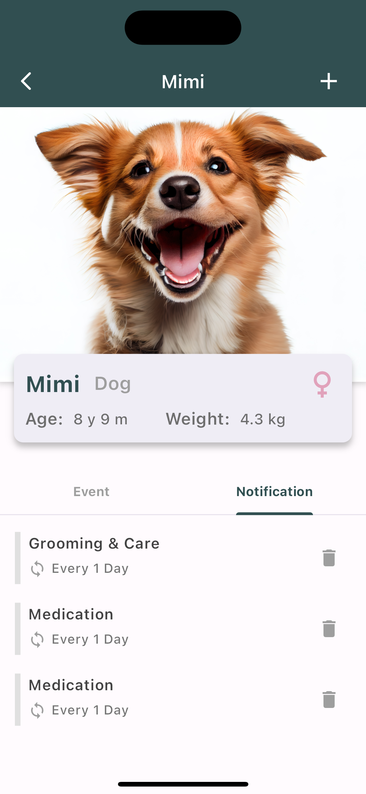
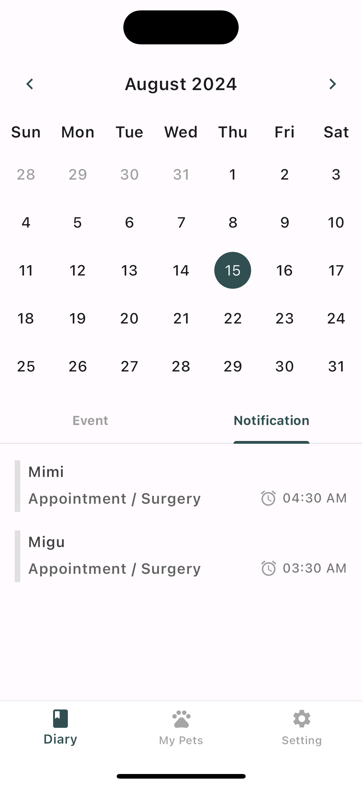
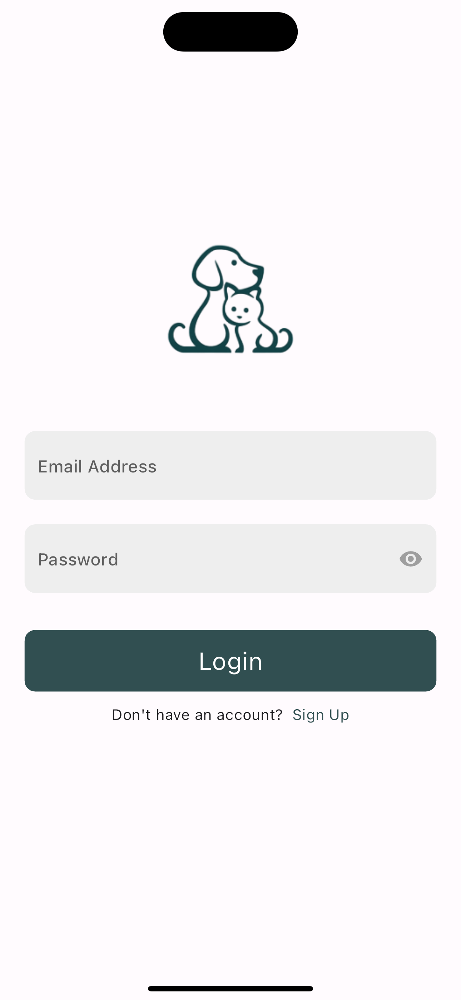
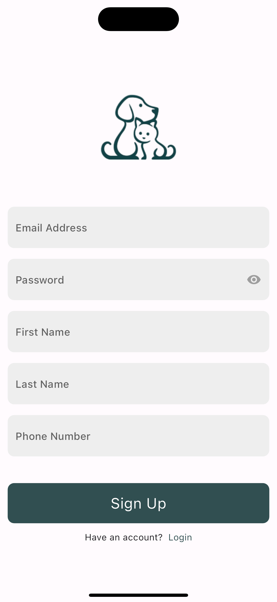
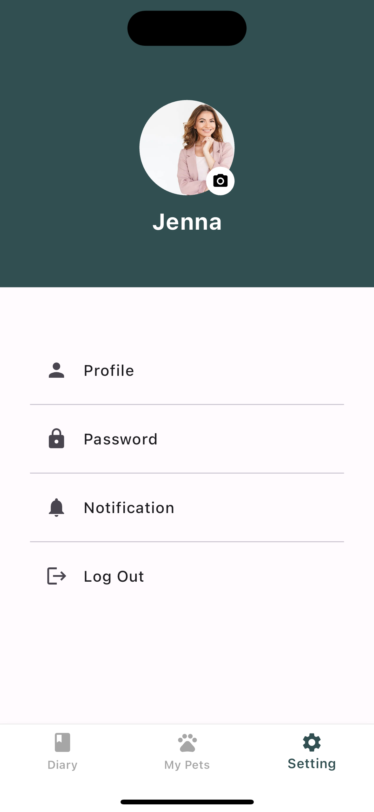
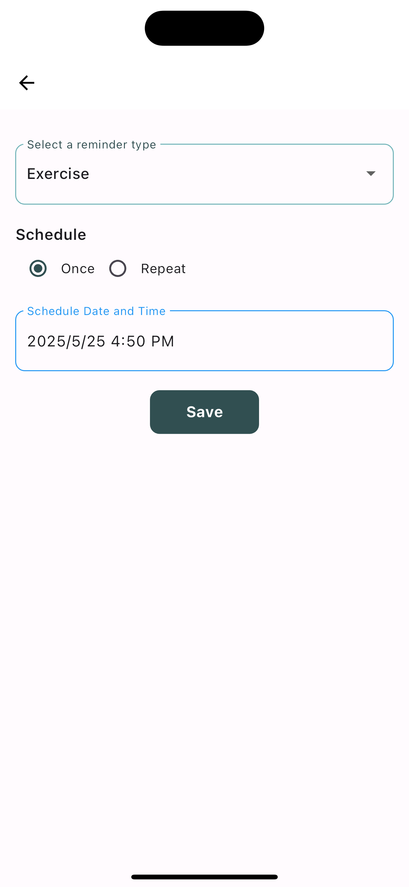
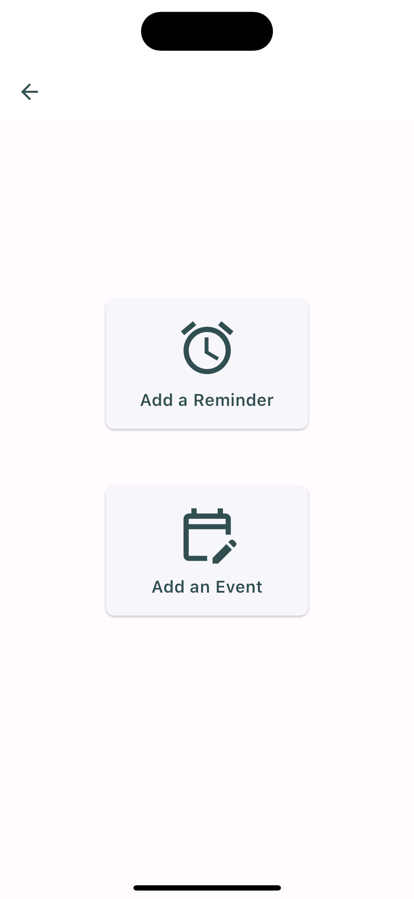

# PetCare Record

A comprehensive pet care management application that helps pet owners track and manage their pets' daily care routines, health records, and important events.

## App Preview

<div align="center">
  
  
  
</div>

## Key Features

### User Authentication & Profile

<div align="center">
  
  
  
</div>

- Secure email and password authentication
- User profile management
- Personal settings and preferences

### Pet Management & Health Records

<div align="center">
  
  
</div>

- Comprehensive pet profiles with photos
- Health records and medical history
- Weight and growth tracking
- Age and birthday management

### Event Tracking & Reminders

<div align="center">
  
  
</div>

- Interactive calendar interface
- Customizable reminder system
- Multiple reminder types:
  - Medical appointments
  - Grooming sessions
  - Medication schedules
  - Exercise routines
  - Regular check-ups
- Flexible scheduling with recurring options

### Quick Actions & Navigation

<div align="center">
  
  
</div>

- Intuitive bottom navigation
- Quick access to common actions
- Streamlined user experience

## Technical Details

### Built With

- Flutter/Dart
- Firebase (Authentication, Firestore, Storage)
- GetX State Management
- Provider Pattern
- MVVM Architecture

### Key Technical Features

- Real-time data synchronization
- Offline data persistence
- Secure user authentication
- Cloud storage for images
- Push notification system
- Responsive UI design

## Installation

1. Clone the repository

```bash
git clone https://github.com/yourusername/PetCare_Record.git
```

2. Install dependencies

```bash
flutter pub get
```

3. Run the app

```bash
flutter run
```

## Requirements

- Flutter SDK: >=3.0.0 <4.0.0
- Dart SDK: >=2.19.6 <3.0.0
- iOS: 11.0 or higher
- Android: API level 21 or higher

## Architecture

The application follows the MVVM (Model-View-ViewModel) architecture pattern for better separation of concerns and maintainability:

- **Models**: Handle data and business logic
- **Views**: Handle UI representation
- **ViewModels**: Manage UI state and business logic
- **Services**: Handle external interactions and data operations

## Security

- Secure user authentication via Firebase
- Encrypted data transmission
- Private data storage
- Regular security updates

## Future Enhancements

- Multi-language support
- Advanced analytics and health trends
- Social features for pet communities
- Integration with veterinary services
- Expanded notification options

## License

This project is licensed under the MIT License - see the LICENSE file for details.
